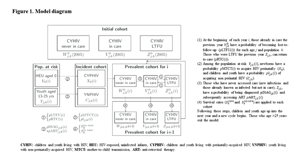

# Thailand Model

The Thailand Model is a multi-state model designed to estimate state of the pediatric and adolescent HIV epidemic in Thailand. It is designed to be easily used by program planners, with two objectives: 

1) to estimate the magnitude of the pediatric and adolescent HIV epidemic among 0-25-year-olds in Thailand and project the likely trends in children and youth living with HIV over a 10-year span

2) to inform research priorities by identifying key gaps in available data and models that markedly impact estimates of the pediatric and adolescent HIV epidemic in Thailand.

## Project Overview
The model is coded in Python 3.7, implementing health states and transition probabilities, with a user interface in Microsoft Excel. 

The Thai Pediatric and Adolescent HIV Modeling Working Group was established to review available data, provide recommendations for key input data for this model, and support development of local capacity on the use of the model. The Working Group is comprised of national AIDS program planners, U.S. CDC Thailand office members, clinicians, epidemiologists, and modelers. Model inputs, including all transition probabilities from one state to another were derived for each calendar year, age, sex, and population.

### Requirements

Requires python 3.7+ (available for download [here](https://www.python.org/downloads/)) with the numpy, matplotlib, xlrd (version 1.2.0 or earlier), and glob modules.

See requirements.txt for more details.

### Program Files

#### thailandSim.py
  - Main program that locates all input file(s) in the folder, then initializes and runs the simulation(s)

#### Thai_MoH_InputSheet.xlsx
  - Blank Excel input file for you to fill out with your data. 

### Running the Model

Step 1 : Create a folder in which you will save both the model and the Excel input sheet.

Step 2 : Fill in the input sheet Thai_MoH_InputSheet.xlsx. There are two types of inputs :
-	In white and please type in the input you wish to use
-	In orange cells, inputs are derived from annex model tools based on data validated by the Thai Working Group. These data are unpublished and available upon request.
-	In blue cells, the input is automated following a series of calculations based on inputs you’ve already included in the model.

Step 3 : Save the input sheet in the folder you created. If desired, fill out more input sheets with different datasets and save them to the same folder. 

At this stage, the folder should contain the model thailandSim.py and the filled input sheet(s) based on the Thai_MoH_InputSheet.xlsx template. 

Step 4 : To run from the command line, call "python thailandSim.py" from the folder containing your Excel input file(s). 

### Model Outputs

The model will return an output file with the extension ".out" and 8 graphs with the extension ".png." 
The .out file can be opened with a text editor or Excel and contains the following data : 
-	Summary of the number of children and youth living with HIV (CYHIV) in each risk group for each year, as well as the overall number of deaths, LTFU, return to care and new infections for each year.
-	Number of CYHIV alive and not in care by year of age, calendar year and risk group
-	Number of CYHIV alive and in care by year of age, calendar year and risk group
-	Number of CYHIV alive who are lost to follow-up by year of age, calendar year and risk group
-	Number of CYHIV who died and who were not in care by year of age, calendar year and risk group
-	Number of CYHIV who died in care by year of age, calendar year and risk group
-	Number of CYHIV who died and who were lost to follow-up by year of age, calendar year and risk group
-	Number of CYHIV newly lost to follow-up by year of age, calendar year and risk group
-	Number of CYHIV who returned to care by year of age, calendar year and risk group
-	Number of new HIV infections by year of age, calendar year and risk group

The .png files are graphs presenting the following data : 
-	Number of CYHIV by calendar year according to care (including those aged out > 25 years)
-	Number of CYHIV by calendar year according to care and risk group ((including those aged out > 25 years)
-	Number of CYHIV by calendar year according to age
-	Proportion of CYHIV by calendar year according to age
-	Number of CYHIV by calendar year according to risk group
-	Number of new infections by calendar year according to risk group
-	Number of CYHIV 0 – 25 years by calendar year according to care (excluding those aged out > 25 years)
-	Number of CYHIV 0 – 25 years by calendar year according to care and risk group (excluding those aged out > 25 years)

## License
[MIT](https://choosealicense.com/licenses/mit/)

## Disclaimer

The Thailand model source code is provided by the Medical Practice Evaluation Center (MPEC) at Massachusetts General Hospital in Boston, MA, USA for interested readers and reviewers. This repository does not include data sources, populated project-specific input files, or comprehensive instructions on how to derive input parameters. We are not responsible or liable for third party use of this model and cannot endorse any results obtained by users not associated with the MPEC.

## Acknowledgements

The project described was supported by a grant from amfAR, the Foundation for AIDS Research. Its contents are solely the responsibility of the authors and do not necessarily represent the official views of the funder.

The funding sources had no role in the design, implementation, or publication of this software.

